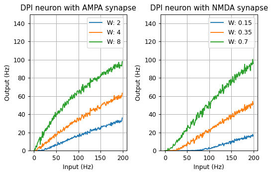

Dynap-SE Simulator (The Institute of Neuroinformatics, UZH and ETHZ)
1	Goal of the Tool

The Dynap-SE simulator is designed for emulating the circuit dynamics of the mixed-signal Dynap-SE1 neuromorphic processor [CITE] for educational and research purposes. The simulator aims to accelerate the iteration time from the development of new spiking neural network architectures to deployment on the hardware by faithfully replicating the circuit dynamics and the Dynap-SE1 control interface. Its minimal design eases understanding of silicon neural dynamics by observing every state variable.

2	Description of the implementation

Dynap-SE simulator is a Brian2 [CITE] based Python library that emulates the Adaptive Exponential Integrate-and-Fire model (AdExp) neuron and Differential Pair Integrator (DPI) synapse circuit dynamics based on Chicca et. al, 2014 [CITE]. This allows users to create spiking neural networks on Brian2, run the network models and observe neuronal and synaptic variables, while the simulator calculates the corresponding circuit dynamics of the Dynap-SE1 neuromorphic processor.

The main files in the simulator are described in the folder hierarchy below.

dynapse-simulator/
├─ equations/
│  ├─ dynapse_eq.py
├─ examples/
│  ├─ GPU.ipynb
│  ├─ multiprocessing.ipynb
├─ exercises/
│  ├─ Part1.ipynb
│  ├─ Part2.ipynb
│  ├─ Part3.ipynb
├─ parameters/
│  ├─ constants.py
│  ├─ dynapse_param.py
│  ├─ set_params.py
├─ utils/
│  ├─ utils.py
├─ DynapSE.py
├─ environment.yml

equations/ : This folder includes dynapse_eq.py that describes non-linear differential equations that govern DPI neuron and four types of DPI synapse (NMDA, AMPA, GABAA, GABAB) circuit dynamics.

examples/ : This folder includes example implementations that accelerate the simulator on the GPU and multiprocessing architectures.

exercises/ : This folder includes three educational materials each of which might be used as one-hour course material. Part1.ipynb covers the introduction to DPI neuron and synapses, describes the API of the simulator and implements a simple spiking neural network where the current levels on synapse and neuron membrane can be monitored. Part2.ipynb covers the characterization of silicon neurons and four types of synapses. Part3.ipynb covers the adaptation mechanism implemented in the silicon neurons.

parameters/ : This folder includes constants.py and dynapse_param.py that contains default parameters for neuron and synapse circuit biases. set_params.py allows the user to easily set parameters to neuron and synapse models by providing a dictionary with keys (parameter names) and values.

DynapSE.py : This file describes the main DynapSE class and functions that define the hardware resources of the DynapSE-1 neuromorphic processor board and restricts users to create networks that can be implemented on the hardware. The functions e.g. set_bias(bias_dictionary, core_number) and add_connection (source_neuron_ID, target_neuron_ID, synapse_type) mimics the API of SAMNA software that is used for programming the DynapSE neuromorphic hardware family.

environment.yml : This file lists the requirements of the simulator.

3	Installation

The code repository is located at https://code.ini.uzh.ch/ncs/libs/dynapse-simulator . The installation requires Python>=3.8 and conda package. Users can then install the library requirements inside a conda environment using conda env create -f environment.yml .

4	Usage

Once the conda environment with installed requirements is created using conda env create -f environment.yml , the user can activate the conda environment with  conda activate dynapse_sim and start interacting with exercise Jupyter lab with running  jupyter lab.

5	Results

The user can form arbitrary spiking patterns and feed it to a single DPI neuron. The simplified code can be seen below.

network = Network() # Instantiate a Brian2 Network
chip = DynapSE(network) # Instantiate a Dynap-SE1 chip neural and synaptic silicon dynamics

DPI_neuron  = chip.get_neurons(1, 'Core_1') # Allocate single DPI neuron from Core 1
DPI_NMDA_synapse = chip.add_connection(input_spike_generator, DPI_neuron, synapse_type='NMDA') 
DPI_AMPA_synapse = chip.add_connection(input_spike_generator, DPI_neuron, synapse_type='AMPA') 
chip.connect(DPI_NMDA_synapse, True)
DPI_NMDA_synapse.weight = 0.5
chip.connect(DPI_AMPA_synapse, True)
DPI_AMPA_synapse.weight = 2

network.add([input_spike_generator, DPI_neuron, DPI_NMDA_synapse, DPI_AMPA_synapse, mon_neuron_input, mon_synapse_nmda, mon_synapse_ampa, mon_neuron_output, mon_neuron_state])
network.run(inp_duration * 1000 * ms)

Fig X1: 100 Hz Poisson spike train is given into a single DPI neuron. The user can observe membrane current variables and output spikes (copied from Part1.ipynb)

Fig X2: AMPA and NMDA synaptic circuit currents can be monitored during the network simulation under Poisson spikes (copied from Part1.ipynb)

Fig X3: The characterization of DPI neuron (F-F curve) using different synapse types and synaptic strengths (copied from Part2.ipynb)

Fig X4: The spike frequency adaptation mechanism implements reducing of the firing rate of a neuron based on how much it has recently fired (copied from Part3.ipynb)
